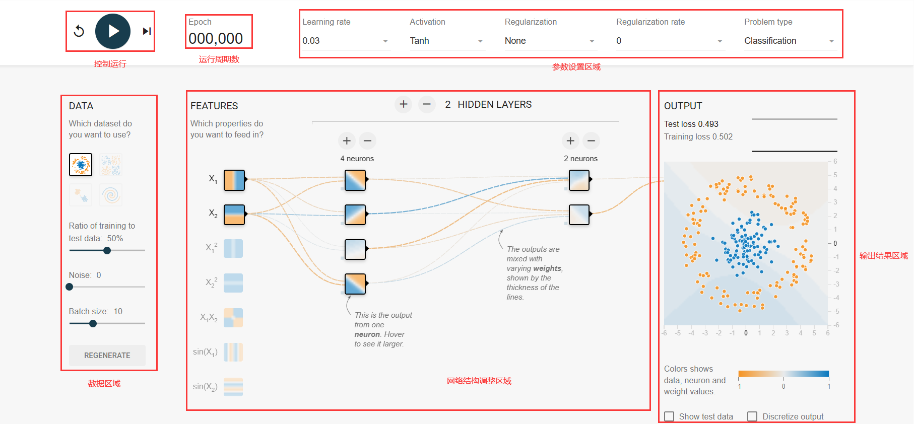

#Tensorflow Playgroud 试用报告
##一. Tensorflow Playground界面示意图
  

###（一）控制运行区域
从左到右三个功能分别是：（a）重启 （b）运行 （c）以此运行一个周期。
###（二）运行周期数设置
用于设置及查看训练的周期数
###（三）参数调整区域
（1）Learning rate：学习率（是一个超参数，在梯度下降算法中会用到；学习率是人为根据实际情况来设定）。
（2）Activation：激活函数（默认为非线性函数Tanh；如果对于线性分类问题，这里可以不使用激活函数）。
（3）Regularization：正则化（正则化是利用范数解决过拟合的问题）。
（4）Regularization rate：代表正则化函数的相对重要性。
（5）Problem type：指明所要完成的任务类型，分类任务或回归任务。
###（四）数据区域
（1）DATA：设置输入数据集类型。平台在这里提供四种数据集，默认选中第一种；被选中的数据也会显示在最右侧的OUTPUT中；在这些数据中，可以看到二维平面上有蓝色和黄色的小点；每一个小点代表一个样例例子；点的颜色代表样例的标签；如果只有两种颜色，那么就是一个二分类问题）。
（2）Ratio of training to test：设置数据用于测试的比例（直接对进度条进行操作即可调整）。
（3）Noise：设置是否对数据引入噪声以及引入噪声的比例
（4）Batch size：调整batch size的大小。
###（五）网络结构调整区域
（1）FEATURES： 设置特征向量种类及个数。将一个实际问题对应到空间中的点，需要提取特征。x1，x2可以代表实际问题的不同特征种类。直接通过点击各个图标即可选择Features的类型
（2）HIDDEN LAYERS：隐藏层。在输入和输出之间的神经网络称为隐藏层；一般神经网络的隐藏层越多这个神经网络越深；这里默认有一个隐藏层，这个隐藏层上有4个节点。可以直接选择加减号即可获得想要的隐藏层层数以及每层的神经元个数。
###（六）输出结果区域
设置完上面的参数，点击运行即可观测到输出结果的变化。若选择的是分类问题，即可看到明显的边界变化以及loss在不断减小的情况，show test data可以显示未参与训练的test数据集的情况，点击Discretize output可以看到离散化后的结果。
###二. 总结
TensorFlow Playground对于初学者是一个非常好的试验产品，可以动手去调整网络参数来显示出对应的网络结构及其效果，并检查模型效果是否与自己的预期相同，如果结果不理想，想办法通过调整那些参数让模型的性能变得更好，是一个实验调试平台。